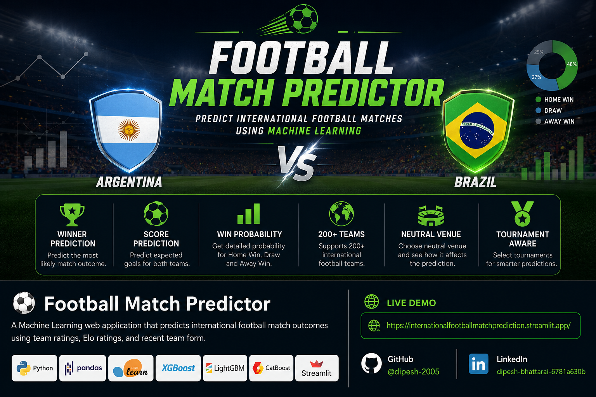
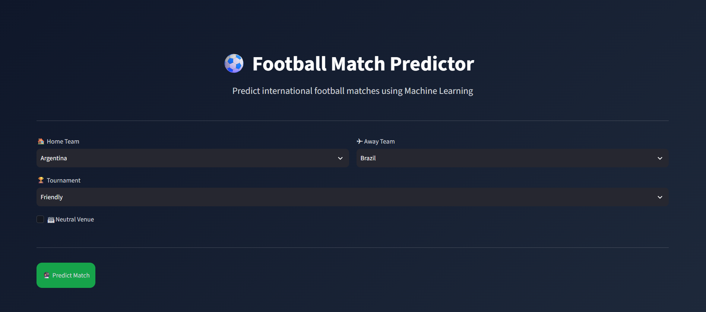
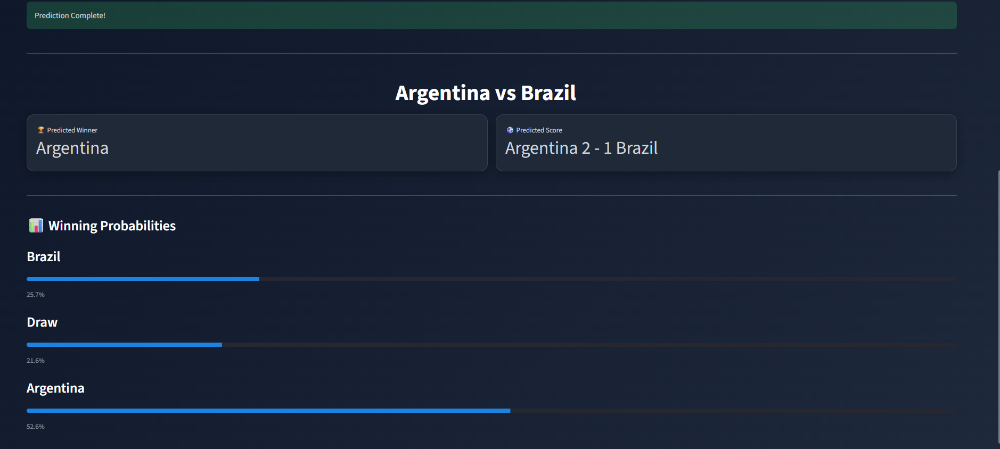

# ⚽ Football Match Predictor



A Machine Learning-powered web application that predicts the outcome of international football matches using **FIFA team ratings, Elo ratings, and recent team form**.

Built with **Python**, **Scikit-learn**, **XGBoost**, **LightGBM**, **CatBoost**, and **Streamlit**.

---

## 🌐 Live Demo

🚀 **Try the app here:**

**https://internationalfootballmatchprediction.streamlit.app/**

---

## 📌 Features

- 🏆 Predicts the winner of international football matches
- ⚽ Predicts expected goals for both teams
- 📊 Displays winning probabilities
- 🌍 Supports 200+ international teams
- 🏟 Supports neutral venue prediction
- 🏆 Tournament-aware predictions
- 🎨 Interactive Streamlit web application
- ⚡ Fast predictions using pre-trained Machine Learning models

---

## 🧠 Machine Learning Models

### Winner Prediction

The winner prediction model is trained as a multiclass classification problem.

Models experimented:

- Logistic Regression
- Decision Tree
- Random Forest
- XGBoost
- LightGBM
- CatBoost

✅ **Final Model:** XGBoost Classifier

---

### Goal Prediction

Separate regression models were trained for:

- Home Goals
- Away Goals

Models experimented:

- Linear Regression
- Random Forest Regressor
- XGBoost Regressor
- LightGBM Regressor
- CatBoost Regressor

✅ **Final Models:** LightGBM Regressor

---

## 📂 Dataset

The project is built using three datasets.

### Player Aggregates

Contains FIFA player ratings aggregated by country.

Includes:

- Overall Rating
- Attack Rating
- Defense Rating
- Pace
- Passing
- Shooting

---

### Team Form

Historical rolling statistics including:

- Average Goals Scored
- Average Goals Conceded
- Win Rate

---

### Match Features

Historical international football matches with:

- Elo Ratings
- FIFA Ratings
- Team Form
- Match Result
- Tournament
- Home/Away Information

---

## 📈 Features Used

The models use:

- Home Elo
- Away Elo
- Elo Difference
- Home Overall Rating
- Away Overall Rating
- Attack Difference
- Defense Difference
- Team Form Statistics
- Goals Scored
- Goals Conceded
- Win Rate
- Neutral Venue
- Tournament Type

---

## 🖥️ Streamlit Interface

Users can:

- Select Home Team
- Select Away Team
- Select Tournament
- Choose Neutral Venue
- Predict Match

The application displays:

- 🏆 Predicted Winner
- ⚽ Predicted Score
- 📊 Winning Probabilities

---

## 📁 Project Structure

```text
footballmatchesprediction/
│
├── app.py
├── requirements.txt
├── README.md
│
├── data/
│   ├── player_aggregates.csv
│   ├── teams_form.csv
│   └── teams_match_features.csv
│
├── models/
│   ├── winner_prediction_model.pkl
│   ├── home_goals_model.pkl
│   ├── away_goals_model.pkl
│   └── label_encoder.pkl
│
├── notebooks/
│   ├── footballprediction.ipynb
│   └── goalprediction.ipynb
│
└── src/
    ├── feature_builder.py
    ├── model_loader.py
    ├── predict.py
    ├── preprocess.py
    └── utils.py
```

---

## 🚀 Installation

Clone the repository:

```bash
git clone https://github.com/dipesh-2005/footballmatchesprediction.git
```

Move into the project directory:

```bash
cd footballmatchesprediction
```

Install dependencies:

```bash
pip install -r requirements.txt
```

Run the Streamlit app:

```bash
streamlit run app.py
```

---

## ⚙️ Technologies Used

- Python
- Pandas
- NumPy
- Scikit-learn
- XGBoost
- LightGBM
- CatBoost
- Plotly
- Streamlit
- Joblib

---

## 📊 Future Improvements

- Expected Goals (xG) Prediction
- Live FIFA Rankings Integration
- Player Injury Analysis
- Team Comparison Dashboard
- Head-to-Head Statistics
- Match Simulation
- Tournament Bracket Prediction
- Interactive Visualizations

---

## 📸 Demo

### Home Screen



### Prediction Result



---

## 🤝 Connect With Me

### 👨‍💻 Dipesh Bhattarai

- **GitHub:** https://github.com/dipesh-2005
- **LinkedIn:** https://www.linkedin.com/in/dipesh-bhattarai-6781a630b

---

## ⭐ Support

If you found this project useful, consider giving it a ⭐ on GitHub!

---

## 📜 License

This project is licensed under the **MIT License**.